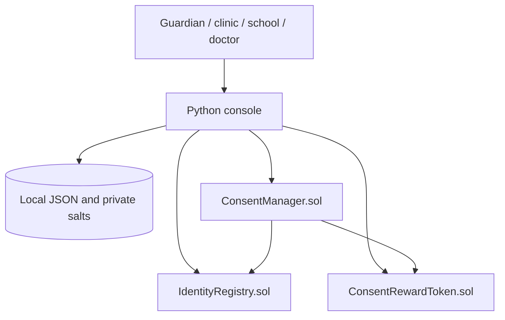
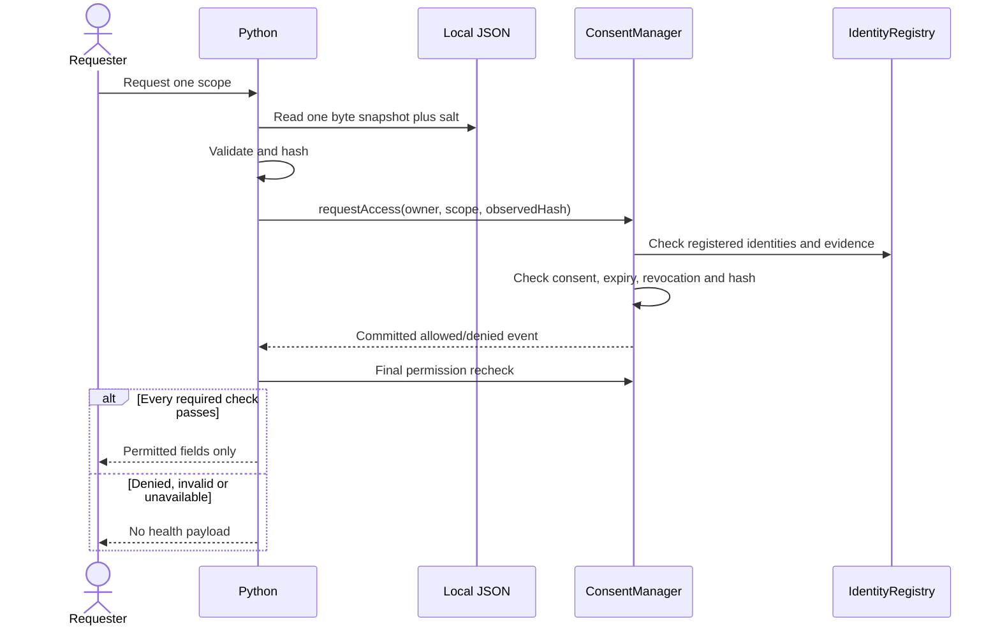

# One-week architecture

This replaces the earlier Java/Fabric design. Implement Python plus exactly three Solidity contracts on the local Hardhat lab network. The old Java scaffold is preserved in archive/previous_java_scaffold.zip on the Desktop project.

IdentityRegistry stores hashed account identity and one frozen vaccination commitment per guardian, attested by a fixed clinic. ConsentManager owns exact owner/requester/scope expiry/revocation, access events and lifetime reward deduplication. ConsentRewardToken maintains non-transferable units and only permits the configured manager to mint.

Python is the trusted disclosure boundary. It reads and hashes the same local byte snapshot, submits a logged access attempt, checks the successful event/receipt, rechecks current permission and returns only allowlisted fields. Anyone with OS-level plaintext access can copy the file outside the app; this is a synthetic local demo, not production healthcare access control.

Well-formed business denial must eventually return false with an event, not revert. Current placeholder methods deliberately revert until implemented; do not confuse that with final denial behavior. Malformed transactions/RPC failures cannot create on-chain events. An event records authorization, not physical delivery. Revocation cannot retract already-disclosed data.
