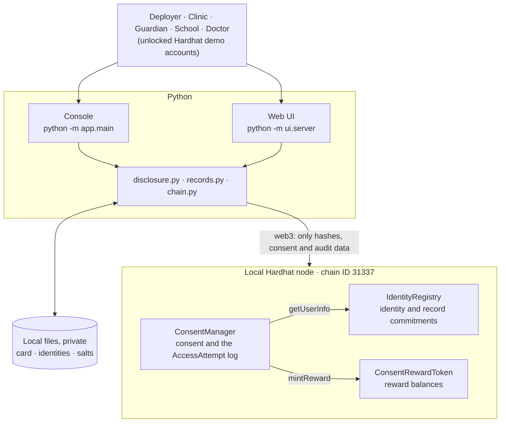

# Architecture

How the parts fit together, where data lives and how an access request works. Contract rules: [CONTRACT_API.md](CONTRACT_API.md).

## Components

```mermaid
flowchart TB
    actors["Deployer · Clinic · Guardian · School · Doctor<br/>(unlocked Hardhat demo accounts)"]

    subgraph python["Python"]
        console["Console<br/>python -m app.main"]
        webui["Web UI<br/>python -m ui.server"]
        core["disclosure.py · records.py · chain.py"]
    end

    files[("Local files, private<br/>card · identities · salts")]

    subgraph hardhat["Local Hardhat node · chain ID 31337"]
        registry["IdentityRegistry<br/>identity and record commitments"]
        manager["ConsentManager<br/>consent and the AccessAttempt log"]
        token["ConsentRewardToken<br/>reward balances"]
    end

    actors --> console
    actors --> webui
    console --> core
    webui --> core
    core <--> files
    core -->|"web3: only hashes, consent and audit data"| hardhat
    manager -->|getUserInfo| registry
    manager -->|mintReward| token
```

## Roles

| Role | What it does |
|---|---|
| Deployer | Deploys the contracts; sets the token's minter once |
| Clinic | Trusted issuer: attests the guardian's record (puts its commitment on-chain); never registers |
| Guardian | Holds the child's card (the child has no wallet); registers, grants and revokes consent, earns rewards |
| School | Registers; requests measles status (scope 1) |
| Doctor | Registers; requests vaccination schedule (scope 2) |

## Where the data lives

The chain holds only **salted hash commitments**: a hash of a file plus a secret random value (the salt). It proves a file is unchanged without revealing it. Formula: [data/README.md](../data/README.md).

| Where | What |
|---|---|
| Local files (private) | Card, identity files, one salt per file |
| IdentityRegistry (public) | Identity commitment per account; frozen record commitment per guardian |
| ConsentManager (public) | Consent per owner, requester and scope; AccessAttempt log |
| ConsentRewardToken (public) | Reward balances |

## Access flow

Run by app/disclosure.py for each request:

1. Python hashes the local card with its salt (a zero hash if either is missing).
2. It calls `requestAccess(owner, scope, hash)` from the requester's wallet.
3. ConsentManager checks the rules and the hash, then logs one AccessAttempt, allowed or denied.
4. On a denial nothing is released; a missing card or salt shows as "unavailable", not a medical "no".
5. Python rechecks the commitment and consent; if consent just ended, it logs a second denial and stops.
6. It releases only that scope's fields: the school gets `{"measles_status": "verified"}`, the doctor each dose's vaccine and date.

## Design decisions

- **Only commitments on-chain:** the chain is public and permanent.
- **Denials are logged, not reverted:** a revert would erase the audit record.
- **Frozen records:** an attested commitment cannot be swapped, so card edits are caught.
- **Narrow scopes:** the school learns a status, never dates.
- **Python releases data:** contracts cannot keep secrets.
- **Non-transferable rewards:** access never reads a balance.
- **One storage slot per consent:** about 20,000 gas less per revoke or first grant (SOL-CM-21).

## Limitations

- Local demo, synthetic data only.
- Anyone with file access can copy the card outside the app.
- An AccessAttempt proves permission, not delivery. Revoking cannot recall released data.
- Registration proves no real identity; one person can hold many wallets (SOL-IR-09).
- Reward farming: k wallets can mint 2 × k² units by granting each other (SOL-CM-22).
- One fixed clinic; an attested record cannot be corrected.
- Consent names a wallet, not an organization.
