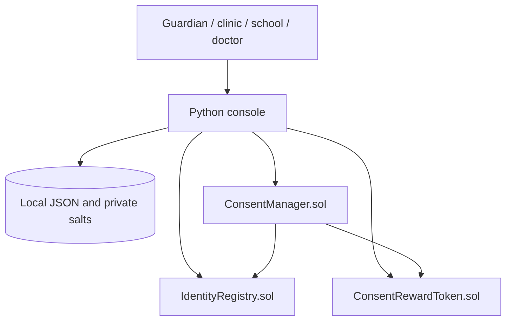
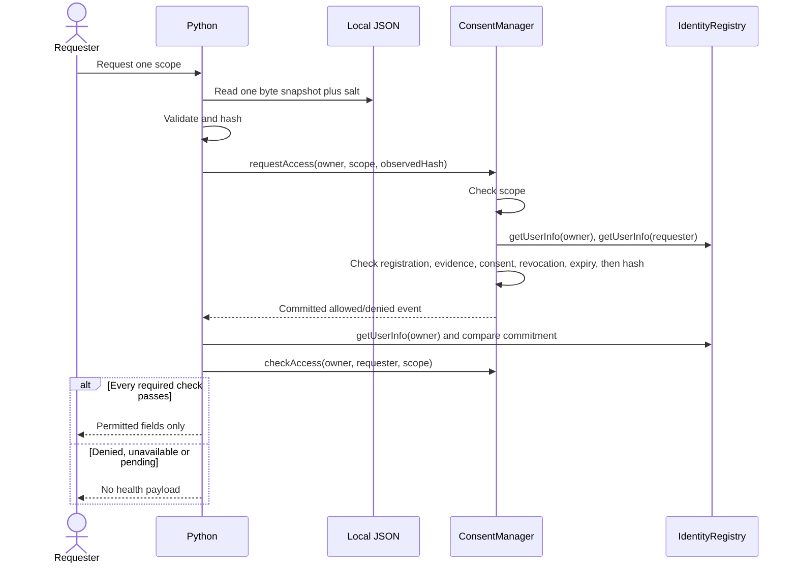

# Architecture

AI assistance: parts of this project were written with Claude (Anthropic) and thoroughly reviewed.

A Python console and scripts use exactly three Solidity contracts on a local Hardhat node (chain ID 31337). Child data stays in local JSON; the chain holds only salted commitments and consent, audit and reward metadata.

```mermaid
flowchart TB
    Actors[Guardian / clinic / school / doctor]
    App[Python console]
    Data[(Local JSON and private salts)]
    Consent[ConsentManager.sol]
    Registry[IdentityRegistry.sol]
    Token[ConsentRewardToken.sol]
    Actors --> App
    App --> Data
    App --> Consent
    App --> Registry
    App --> Token
    Consent --> Registry
    Consent --> Token
```

IdentityRegistry stores a hashed identity per account and one frozen vaccination commitment per guardian, attested by the one trusted clinic fixed at deployment. ConsentManager owns exact owner/requester/scope consent with expiry and revocation, the access events and lifetime reward deduplication. ConsentRewardToken keeps non-transferable units and lets only the configured manager mint. [CONTRACT_API.md](CONTRACT_API.md) has the functions, events, errors and rules.

## Components

| Component | Role |
| --- | --- |
| app/main.py | Console menu: pick an actor (deployer, clinic, guardian, school or doctor), then setup, register, attest, grant, revoke, school check, doctor view, rewards, audit or show my registration. |
| app/records.py | Local JSON files and their 32-byte salts under data_root (runtime-data/ by default). A commitment is SHA-256 of a purpose prefix, the salt and the exact file bytes. |
| app/disclosure.py | The release rule below, and the two views: the school gets `{"measles_status": "verified"}`, the doctor gets vaccine and date for each vaccination. |
| app/chain.py | The web3 boundary. Every contract call and transaction goes through it; it checks deployment.json against the node, decodes events and turns reverts into Solidity error names. |
| app/models.py | Scope and Reason codes (the same as ConsentManager), shared types and exceptions. |
| scripts/deploy_local.py | Deploys the three contracts in order, verifies each step and writes deployment.json. |
| integration/demo_workflow.py | Deploys fresh contracts and runs the whole story on the node (register, attest, school, doctor, tamper, revoke, regrant, exact expiry, rewards, audit), checking every outcome. |
| evaluation/ | measure.py writes the gas and timing tables; export_solidity_results.py and export_python_results.py write the SOL and PY test result rows. |

## Disclosure

Python is the trusted disclosure boundary (app/disclosure.py). For one request it reads the local record once and hashes that byte snapshot with its salt, then submits requestAccess, so the attempt is logged. It requires exactly one AccessAttempt from the manager in the receipt, with the expected owner, requester and scope. It then compares the snapshot hash with the registered commitment (getUserInfo), rechecks current permission (checkAccess) and returns only allowlisted fields from the same bytes. If the final recheck fails, it submits one more requestAccess so the late denial is logged, and releases nothing. If the local record or its salt cannot be read or validated, it sends a zero observedHash, so the attempt is still logged, and the outcome is unavailable, not a clinical result. Anyone with OS-level plaintext access can copy the file outside the app; this is a synthetic local demo, not production healthcare access control.

```mermaid
sequenceDiagram
    actor Requester
    participant Python
    participant JSON as Local JSON
    participant Manager as ConsentManager
    participant Registry as IdentityRegistry
    Requester->>Python: Request one scope
    Python->>JSON: Read one byte snapshot plus salt
    Python->>Python: Validate and hash
    Python->>Manager: requestAccess(owner, scope, observedHash)
    Manager->>Manager: Check scope
    Manager->>Registry: getUserInfo(owner), getUserInfo(requester)
    Manager->>Manager: Check registration, evidence, consent, revocation, expiry, then hash
    Manager-->>Python: Committed allowed/denied event
    Python->>Registry: getUserInfo(owner) and compare commitment
    Python->>Manager: checkAccess(owner, requester, scope)
    alt Every required check passes
        Python-->>Requester: Permitted fields only
    else Denied, unavailable or pending
        Python-->>Requester: No health payload
    end
```

A well-formed business denial returns false with an event, not a revert: requestAccess emits exactly one AccessAttempt per call, allowed or denied. Reverts are used for malformed or unauthorized transactions (for example NotTrustedClinic, InvalidDuration), which leave no event. Malformed transactions and RPC failures cannot create on-chain events. An event records authorization, not physical delivery. Revocation cannot retract data already disclosed.
